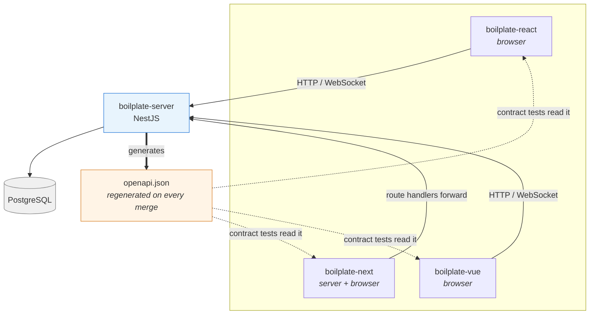

# BOILPLATE

Four production-shaped boilerplates, one shared backend, one contract between
them. This repository is the entry point: what each one is for, how to pick, and
what they all agree on.

```
npx tsx cli/src/index.ts my-app
```

That is `create-fredo-app`. It asks which framework and whether you want the
backend, clones what it needs, fills in the environment, and leaves you a project
with no history but yours. [Full options](cli/README.md).

---

## The four repositories

| | One sentence |
| --- | --- |
| **[boilplate-react](https://github.com/fredokim/boilplate-react)** | A React SPA where the server's shape is checked at the boundary rather than trusted, so a backend change fails a test instead of a page. |
| **[boilplate-next](https://github.com/fredokim/boilplate-next)** | The same application with the server/client boundary made explicit — the backend's address never reaches the browser, and route handlers forward. |
| **[boilplate-vue](https://github.com/fredokim/boilplate-vue)** | The same application again in Vue, which is what makes the architecture's claims testable: three implementations, one contract, one set of behaviours. |
| **[boilplate-server](https://github.com/fredokim/boilplate-server)** | The NestJS backend all three talk to, and the source of the OpenAPI document their tests are written against. |

They are not three different apps. They are one application — auth, a dashboard,
a realtime topology graph, live chat — built three times against one backend, so
the parts that are genuinely architectural can be told apart from the parts that
are just React, or just Vue.

## Comparison

| | React | Next | Vue |
| --- | --- | --- | --- |
| **Framework** | React 19 · Vite 8 | Next 16 · App Router | Vue 3 · Vite 6 |
| **Rendering** | Client, single bundle | Server Components by default, client where declared | Client, single bundle |
| **State** | Zustand | Zustand | Pinia |
| **Data fetching** | React Query · axios with interceptors | React Query · route handlers proxy to the backend | Hand-written `http-client`, no query library — caching and retry are the app's own |
| **Auth** | Access token in memory, refresh over an HttpOnly cookie | Session read server-side; the browser never holds the backend's address | Access token in memory, refresh over an HttpOnly cookie |
| **Realtime** | WebSocket, validated frames, resume by `sequence` | Same, plus a server-side data-mode guard | Same |
| **Storybook** | Storybook 10 | Storybook 10 | Storybook 10 |
| **Testing** | Vitest · MSW · Playwright | Vitest · MSW · Playwright | Vitest · MSW · Playwright |
| **Backend** | `boilplate-server`, or MSW with none | `boilplate-server`, or route handlers answering from dummy data | `boilplate-server`, or MSW with none |

Every one of them runs with no backend at all. That is not a demo mode bolted on
— it is how the tests run — and a production build refuses to start on mock data,
so the convenience cannot ship by accident.

## Architecture



The dotted lines are the part worth looking at. Each frontend's tests read the
server's published `openapi.json` and compare it to the DTOs that repository
actually validates, in four directions: a DTO for an endpoint that no longer
exists, a field the server never sends, a field required here but optional there,
a field guaranteed there but optional here. The server's own CI runs all three
frontends' contract tests against the specification a pull request *would*
produce, so a breaking change fails in the repository that caused it.

Next reaches the server through its own route handlers rather than directly.
`BACKEND_URL` has no `NEXT_PUBLIC_` prefix on purpose: with one, the address
would be inlined into the browser bundle and the browser could call the backend
directly — and the refresh token is an HttpOnly cookie with `sameSite: lax`, so a
cross-origin call would never carry it.

## Quick start

**Generate a project** — the usual way in:

```bash
git clone https://github.com/fredokim/BOILPLATE.git && cd BOILPLATE/cli && npm install
```

```bash
cd ~/projects && npx tsx ../BOILPLATE/cli/src/index.ts my-app
```

**Or run one boilerplate directly**, with no backend:

```bash
git clone https://github.com/fredokim/boilplate-react.git && cd boilplate-react && npm install && npm run dev
```

It comes up on mock data. Every environment variable is optional.

**With the backend:**

```bash
git clone https://github.com/fredokim/boilplate-server.git && cd boilplate-server && npm install && cp .env.example .env
```

```bash
npm run db:up && npm run prisma:migrate && npm run start:dev
```

`JWT_SECRET` has no default, deliberately — a fallback would ship as a real
secret in every deployment that forgot to change it. `.env.example` says how to
generate one.

Then set `VITE_DATA_MODE=server` in the frontend, or `BACKEND_URL` **and**
`NEXT_PUBLIC_DATA_MODE` for Next. Those two must agree: one decides what the
route handlers do and the other which transports the browser builds, and the
build refuses a configuration where they disagree.

## Which one

**React** if you are evaluating the architecture itself. It is the reference —
the DTO boundary, the interceptor chain, the realtime controller and the
generators are clearest here, with the least framework machinery in the way.

**Next** if the boundary between server and client is the question. It is the
only one where "who is allowed to know the backend's address" has a real answer,
and where getting it wrong fails a build rather than leaking quietly.

**Vue** if you want to see whether the ideas survive the move. Everything the
other two call architectural is either here too, or was framework-specific after
all — and eleven realtime files are byte-identical across all three, which is
evidence rather than assertion.

**All three** if the point is the comparison. That is what they were built for.

## What they agree on

The shared position across these four repositories is narrower than a style guide
and harder to satisfy.

**A boundary is where you validate, not where you cast.** Every HTTP response is
checked against a DTO before a view sees it, and so is every WebSocket frame —
the sockets used to be cast and trusted while the HTTP path beside them was
validated.

**A check that cannot fail is worse than no check.** Each of these was found
green and proving nothing, and each was fixed by first making it fail: generators
that were asserted to *exist* rather than run; a connection-state vocabulary with
two states unreachable from the UI; a realtime event typed `unknown[]` in the
published contract; an `.env.example` documenting one of two variables the build
requires together.

**Say why, next to the code.** Comments here explain decisions, not syntax — what
was tried, what broke, and what would break again.

**Duplication is a choice you defend, not one you drift into.** The realtime core
is identical in all three repositories on purpose, and `npm run realtime:parity`
reports when it stops being.
[ADR 0001](docs/adr/0001-realtime-core-stays-duplicated.md) is the argument.

## Decisions

Each records what was decided, what else was considered, and what it costs —
because the reason is the part that goes missing, and without it the next person
re-litigates or, worse, quietly reverses it.

| | |
| --- | --- |
| [0001](docs/adr/0001-realtime-core-stays-duplicated.md) | The realtime core stays duplicated |
| [0002](docs/adr/0002-two-kinds-of-generator.md) | Two kinds of generator, and only one of them is a CLI |
| [0003](docs/adr/0003-four-repositories-not-one.md) | Four repositories, not one |
| [0004](docs/adr/0004-openapi-is-the-contract.md) | The server's OpenAPI document is the REST contract |
| [0005](docs/adr/0005-websocket-contract-by-shared-types.md) | The WebSocket contract is typed frames and validated payloads |
| [0006](docs/adr/0006-server-state-and-session-state-have-different-owners.md) | Server state and session state have different owners |
| [0007](docs/adr/0007-refresh-cookie-and-one-origin.md) | The refresh token is a cookie, so the browser must see one origin |

0003 through 0007 were written after the fact, from the code that already
implements them. They are numbered in sequence rather than renumbered to match
the order the decisions were made: 0001 and 0002 are already referenced from
commits, pull requests and the policy, and a stable identifier is worth more than
a tidy chronology.

## What lives here

| | |
| --- | --- |
| **[DEVELOPMENT_POLICY.md](DEVELOPMENT_POLICY.md)** | The rules all four follow, and the ones they deliberately do not share. |
| **[cli/](cli/README.md)** | `create-fredo-app`. |
| **[docs/adr/](docs/adr)** | The decisions, with the alternatives and what they cost. See below. |
| **`scripts/check-realtime-parity.ts`** | `npm run realtime:parity`. Expects the four repositories checked out side by side, or `REPO_ROOT` pointing at their parent. |

No application code lives here. This repository used to hold a Vue starter that
did not build; the three boilerplates supersede it, and it is in the history.
